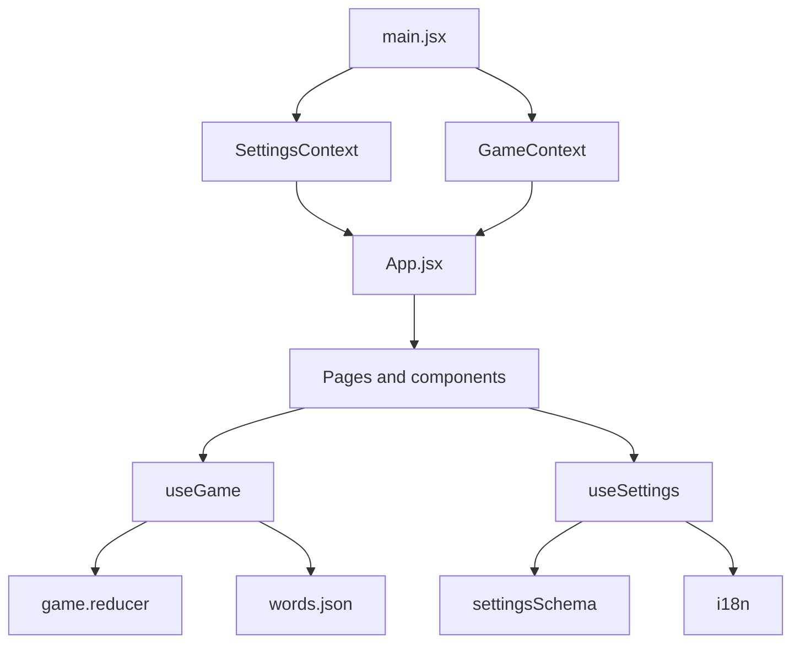

# Architecture

This is a client-side React application built with Vite. Game state uses Context plus `useReducer`; settings use Context plus a local draft in `useSettings`.

## Ownership

- `GameContext` owns game state and reducer dispatch.
- `game.reducer.jsx` owns pure game transitions and invariants.
- `useGame` owns form parsing, setup validation, randomness, word selection, and time conversion.
- `SettingsContext` owns committed settings.
- `useSettings` owns draft editing, schema validation, setup restrictions, and i18n language changes.
- `App` maps `game.phase` to a page and reads the committed theme from settings.
- `Timer` owns only transient countdown state.

## Design Choices

The reducer receives prepared random results rather than calling `Math.random`, preserving purity and testability. Settings use draft/commit semantics so changes can be reset before saving. Game navigation is represented by `game.phase` instead of a router.

