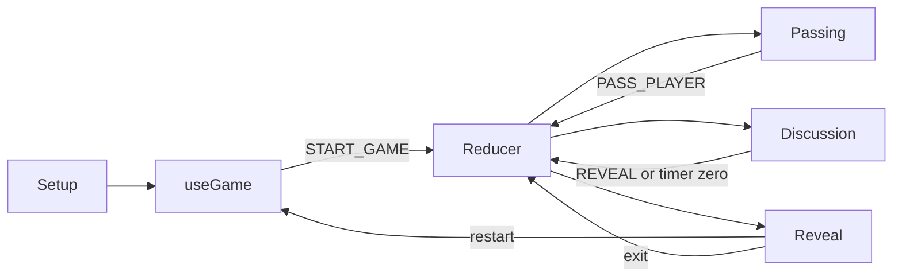

# Game Controller

The game controller is `useGame` in [`src/hooks/useGame.jsx`](../../src/hooks/useGame.jsx). It reads `GameContext` and dispatches commands to the pure game reducer.

## Responsibilities

- Parse setup form values and validate setup state.
- Select random imposter indexes and a random word.
- Dispatch game actions.
- Expose passing, reveal, restart, and exit commands.

## Functions

| Function                      | Behavior                                                                       |
| ----------------------------- | ------------------------------------------------------------------------------ |
| `addPlayer(event)`            | Reads `playerName` and dispatches `ADD_PLAYER`.                                |
| `removePlayer(index)`         | Dispatches `REMOVE_PLAYER`; the reducer enforces bounds and phase.             |
| `editPlayer(index, name)`     | Normalizes the name and dispatches `EDIT_PLAYER`.                              |
| `setTimeLimit(event)`         | Reads minutes, converts to seconds, and dispatches `SET_TIME_LIMIT`.           |
| `mutateImposterCount(action)` | Maps `inc` and `dec` to reducer actions.                                       |
| `selectCategory(category)`    | Checks semantic membership in `words.json`, then dispatches `SELECT_CATEGORY`. |
| `startGame()`                 | Validates setup, assigns roles, selects a word, and dispatches `START_GAME`.   |
| `restart()`                   | Starts a fresh round from `reveal` using the existing configuration.           |
| `exit()`                      | Dispatches `EXIT_GAME` to return to setup and clear round data.                |
| `passPlayer()`                | Dispatches `PASS_PLAYER`.                                                      |
| `reveal()`                    | Dispatches `REVEAL` from discussion.                                           |

Randomness stays in the hook so the reducer remains deterministic and pure.

## Time-limit Contract

```text
input minutes -> useGame.setTimeLimit -> game.timeLimit seconds -> Timer
```

The reducer and timer use seconds. Minute conversion belongs only in the controller.

## Action Flow


