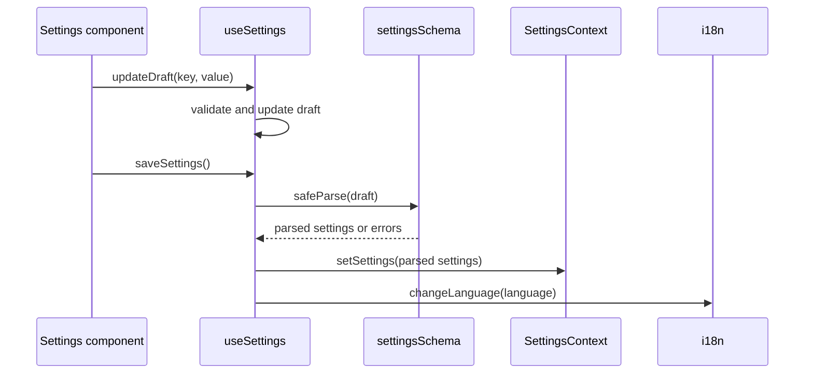

# Settings Controller

The settings controller is `useSettings` in [`src/hooks/useSettings.jsx`](../../src/hooks/useSettings.jsx). It separates editable settings from committed settings.

## State Model

- `settings`: committed values from `SettingsContext`.
- `draft`: local values that are not committed until save succeeds.

The hook reads `game.phase` through `useGame`. Draft updates and saves are ignored outside `setup`.

## Functions

| Function                  | Behavior                                                                                       |
| ------------------------- | ---------------------------------------------------------------------------------------------- |
| `updateDraft(key, value)` | Validates the key/value pair and updates only the draft.                                       |
| `saveSettings()`          | Validates with `settingsSchema`, commits parsed data, and updates i18n language after success. |
| `resetDraft()`            | Replaces the draft with committed settings.                                                    |

## Supported Settings

| Setting      | Values           |
| ------------ | ---------------- |
| `language`   | `en`, `ar`, `fr` |
| `theme`      | `light`, `dark`  |
| `wordRepeat` | boolean          |
| `music`      | boolean          |
| `sound`      | boolean          |

