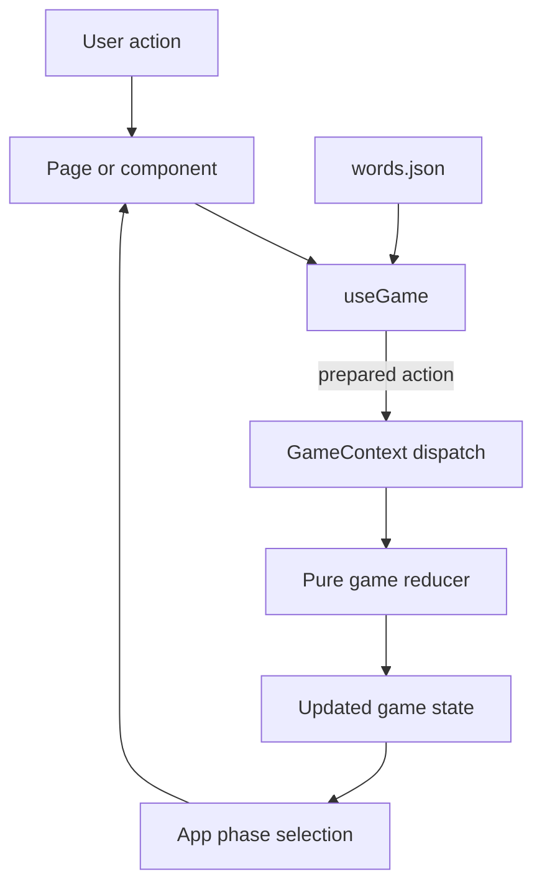
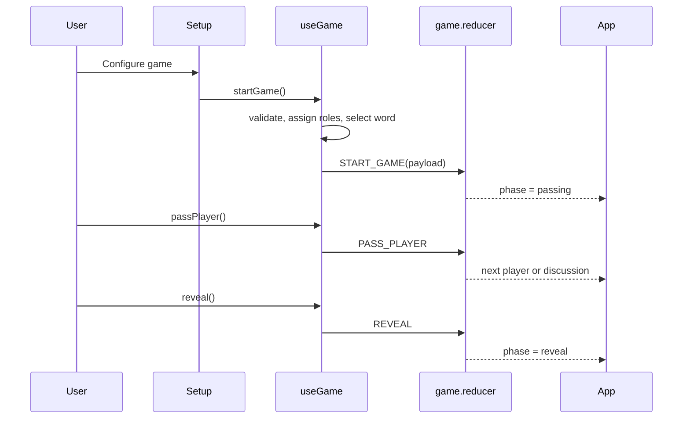
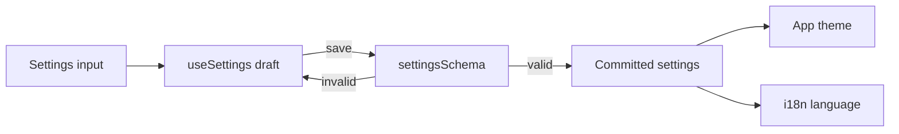
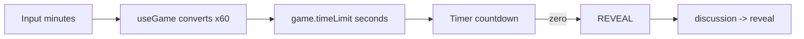

# Data Flow

## Game Flow

## Round Sequence

## Settings Flow

## Time-limit Flow

## State Ownership

| Data                   | Owner            | Notes                                          |
| ---------------------- | ---------------- | ---------------------------------------------- |
| Players and roles      | Game reducer     | Roles regenerate each round and clear on exit. |
| Current word           | Game reducer     | Generated outside reducer and cleared on exit. |
| Phase and player index | Game reducer     | Drive page selection and role passing.         |
| Setup configuration    | Game reducer     | Preserved across restart and exit.             |
| Committed settings     | Settings context | Includes theme and language.                   |
| Editable settings      | `useSettings`    | Committed after schema validation.             |
| Countdown              | `Timer`          | Transient seconds-based state.                 |
